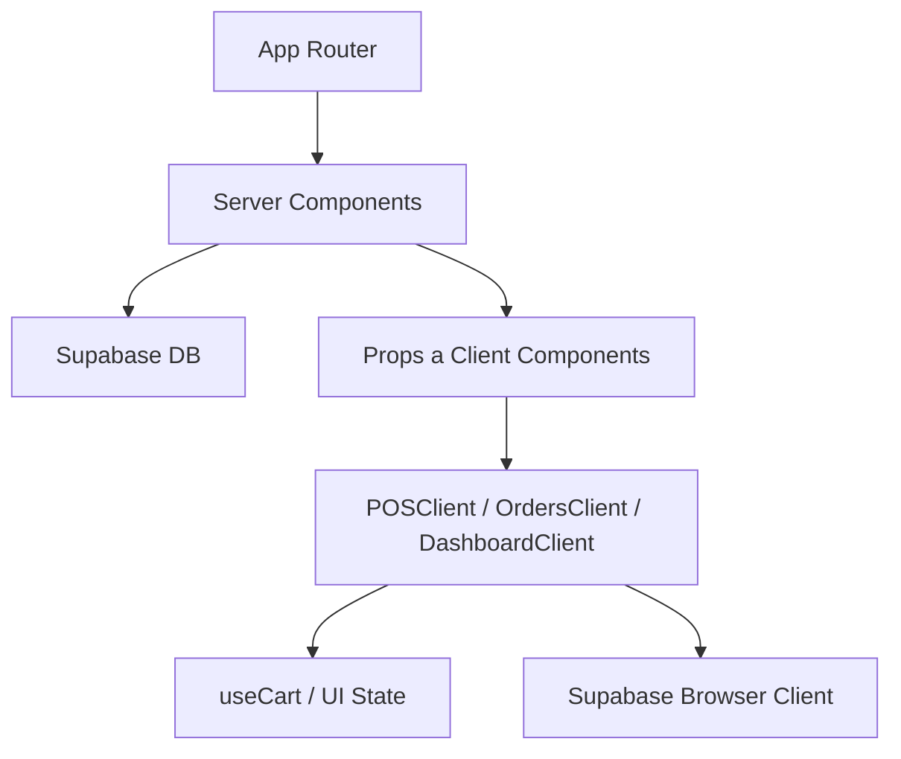
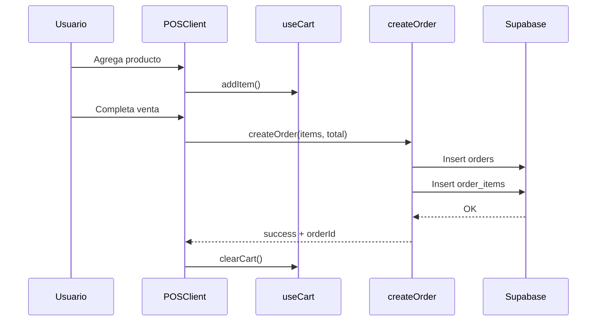
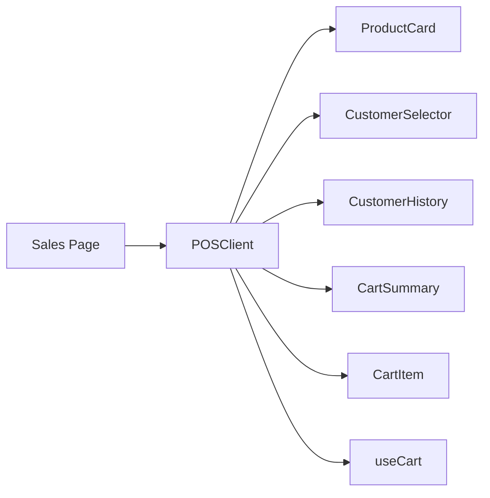
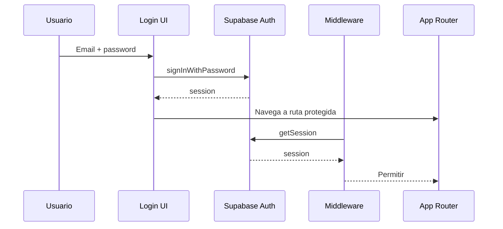
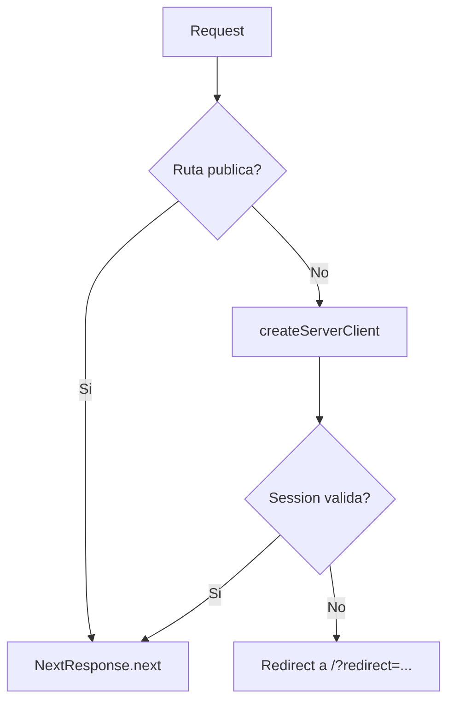

# Documentacion completa del sistema POS

> Fecha de referencia: 30-04-2026

Esta documentacion explica TODO el sistema como si fuera la primera vez que alguien lo ve. Cubre arquitectura, pantallas, flujo de datos, Supabase, autenticacion, base de datos, despliegue y operacion diaria.

## Indice

- [Capitulo 1 - Resumen del sistema](#1-resumen-del-sistema)
- [Capitulo 2 - Guia rapida de onboarding](#2-guia-rapida-de-onboarding-si-no-sabes-nada)
- [Capitulo 3 - Tecnologias](#3-tecnologias)
- [Capitulo 4 - Estructura del proyecto](#4-estructura-del-proyecto-alto-nivel)
- [Capitulo 5 - Rutas y pantallas](#5-rutas-y-pantallas)
- [Capitulo 6 - Autenticacion y acceso](#6-autenticacion-y-control-de-acceso)
- [Capitulo 7 - Supabase](#7-supabase-configuracion-completa)
- [Capitulo 8 - Flujo de ventas](#8-flujo-de-datos-principal-ventas)
- [Capitulo 9 - Gestion de productos](#9-gestion-de-productos)
- [Capitulo 10 - Gestion de clientes](#10-gestion-de-clientes)
- [Capitulo 11 - Ordenes, ventas y componentes](#11-ordenes-y-ventas)
- [Capitulo 12 - Configuracion de usuario](#12-configuracion-de-usuario)
- [Capitulo 13 - i18n](#13-i18n-esen)
- [Capitulo 14 - Scripts y comandos](#14-scripts-y-comandos)
- [Capitulo 15 - Despliegue](#15-despliegue-produccion)
- [Capitulo 16 - Operacion diaria](#16-operacion-diaria-paso-a-paso)
- [Capitulo 17 - Errores comunes](#17-errores-comunes-y-solucion-rapida)
- [Capitulo 18 - Seguridad recomendada](#18-seguridad-recomendada)
- [Capitulo 19 - Notas tecnicas](#19-notas-tecnicas-importantes)
- [Capitulo 20 - Mejoras futuras](#20-inventario-y-mejoras-futuras-ideas)

## Capitulo 1 - Resumen del sistema

Este proyecto es un sistema POS (Punto de Venta) web hecho con Next.js (App Router). Permite:

- Autenticacion de usuarios (registro y login) via Supabase Auth.
- Terminal de ventas con carrito, seleccion de clientes y creacion de ordenes.
- Gestion de productos (alta, edicion, eliminacion).
- Gestion de clientes (alta, edicion, eliminacion).
- Visualizacion de ventas y detalle por orden.
- Configuracion de perfil del usuario autenticado.
- Interfaz bilingue (ES/EN) con i18n local.

La base de datos y autenticacion se gestionan en Supabase.

## Capitulo 2 - Guia rapida de onboarding (si no sabes nada)

Sigue este orden para entender y operar el sistema rapido:

1) Configura Supabase y variables de entorno (ver seccion 7).
2) Inicia el proyecto con `npm run dev`.
3) Crea un usuario en `/register`.
4) Entra a `/products` y agrega productos.
5) Entra a `/customers` y agrega clientes.
6) Entra a `/sales` y registra una venta.
7) Revisa `/orders` y `/dashboard`.

Si algo falla, revisa la seccion 17 (errores comunes).

## Capitulo 3 - Tecnologias

- Next.js 16 (App Router)
- React 19
- TypeScript
- Supabase (Auth + DB)
- Tailwind CSS
- shadcn/ui + Radix UI
- i18n local (archivos JSON)

## Capitulo 4 - Estructura del proyecto (alto nivel)

```
app/                    # Rutas de la app (App Router)
components/             # Componentes UI y feature
hooks/                  # Hooks de estado (useCart)
lib/                    # Clientes Supabase, acciones, i18n
public/locales/         # Traducciones
SUPABASE_SETUP.sql      # SQL de ejemplo para tablas y RLS
```

## Capitulo 5 - Rutas y pantallas

### Publicas
- `/` login
- `/register` registro

### Protegidas (requieren sesion)
- `/dashboard` resumen de ventas
- `/sales` terminal de ventas
- `/products` catalogo de productos
- `/customers` catalogo de clientes
- `/orders` listado y edicion de ordenes
- `/settings` perfil del usuario

La proteccion se hace con middleware (ver seccion Autenticacion).

## Capitulo 6 - Autenticacion y control de acceso

### Flujo de login
1. Usuario abre `/` y llena correo + password.
2. Se usa `supabaseBrowser.auth.signInWithPassword`.
3. Si ok, redirige a `/dashboard` o a la ruta solicitada.

### Flujo de registro
1. Usuario abre `/register`.
2. Se llama `supabaseBrowser.auth.signUp`.
3. Supabase envia correo de confirmacion.

### Middleware de seguridad
El middleware comprueba sesion en TODAS las rutas excepto:
- `/` y `/register`
- assets de Next (`/_next`), `/api`, `/favicon`

Si no hay sesion, redirige a `/` con query `?redirect=/ruta`.

### Archivo clave
- `middleware.ts`

## Capitulo 7 - Supabase: configuracion completa

### 6.1 Variables de entorno
Se requieren en `.env.local`:

```
NEXT_PUBLIC_SUPABASE_URL=...  # URL del proyecto Supabase
NEXT_PUBLIC_SUPABASE_ANON_KEY=...  # anon key
```

Estas variables se usan en:
- `lib/supabase.ts` (server)
- `lib/supabaseBrowser.ts` (client)
- `middleware.ts`

### 6.2 Clientes Supabase
- `lib/supabase.ts`: `createClient` para server components.
- `lib/supabaseBrowser.ts`: `createBrowserClient` para componentes client.
- `middleware.ts`: `createServerClient` para auth en middleware.

### 6.3 Base de datos (tablas principales)

Tablas usadas por la app:

1) `products`
- `id` (uuid, PK)
- `name` (text)
- `description` (text)
- `price` (numeric)
- `stock` (integer)
- `category` (text)
- `created_at` (timestamp)

2) `customers`
- `id` (uuid, PK)
- `name` (text)
- `phone` (text)
- `created_at` (timestamp)

3) `orders`
- `id` (uuid, PK)
- `customer_id` (uuid, FK a customers)
- `total` (numeric)
- `status` (text, default 'completed')
- `created_at` (timestamp)

4) `order_items`
- `id` (uuid, PK)
- `order_id` (uuid, FK a orders)
- `product_id` (uuid, FK a products)
- `quantity` (integer)
- `price` (numeric)  # price snapshot
- `created_at` (timestamp)

### 6.4 SQL de referencia
El archivo `SUPABASE_SETUP.sql` incluye:
- Creacion de `orders` y `order_items`
- Indices
- RLS habilitado
- Politicas permisivas (para pruebas)

IMPORTANTE: Para produccion, debes endurecer RLS.

### 6.5 RLS (Row Level Security)

Actualmente el SQL de ejemplo permite:
- Insert, select, update, delete para cualquier usuario (publico).

Esto es util para pruebas, pero NO seguro. Para produccion:
- Restringe a `authenticated`.
- Aplica reglas por roles o tenant.

Ejemplo minimo recomendado:

```
-- Solo usuarios autenticados pueden leer/insertar
CREATE POLICY "auth read orders" ON orders
  FOR SELECT TO authenticated USING (true);

CREATE POLICY "auth insert orders" ON orders
  FOR INSERT TO authenticated WITH CHECK (true);
```

### 6.6 Auth (usuarios)
- Supabase maneja usuarios (email/password).
- La app no usa tabla `profiles` actualmente.
- En `settings` se actualiza:
  - email
  - metadata: `display_name`, `phone`
  - password

## Capitulo 8 - Flujo de datos principal (ventas)

### 7.1 Pantalla /sales
- Carga productos desde Supabase (server component).
- Renderiza `POSClient`.
- `POSClient` maneja buscador, carrito, cliente y checkout.

### 7.2 Carrito (useCart)
- Estado local en memoria.
- Funciones:
  - `addItem`
  - `removeItem`
  - `updateQuantity`
  - `clearCart`
- Calcula `total` y `itemCount`.

### 7.3 Checkout (creacion de orden)
- `createOrder` en `lib/orders.ts` (server action).
- Recalcula total en servidor para evitar fraude.
- Inserta en `orders` y luego en `order_items`.
- Devuelve `orderId`.

### 7.4 Seleccion de cliente
- `CustomerSelector` abre un dialog con busqueda y paginado.
- Si no hay cliente, usa "Cliente general".
- `CustomerHistory` muestra ultimas 5 compras.

## Capitulo 9 - Gestion de productos

Pantalla `/products`:
- Lista, filtros, busqueda y CRUD.
- Dialogos:
  - `AddProductDialog`
  - `EditProductDialog`
  - `DeleteProductButton`

Campos requeridos:
- name, description, price (> 0), stock (>= 0), category.

## Capitulo 10 - Gestion de clientes

Pantalla `/customers`:
- Lista, busqueda y CRUD.
- Dialogos:
  - `AddCustomerDialog`
  - `EditCustomerDialog`
  - `DeleteCustomerButton`

Campos requeridos:
- name, phone

## Capitulo 11 - Ordenes y ventas

Pantalla `/orders`:
- Tabla con ordenes y detalle desplegable.
- Filtros: periodo, mes, cliente, categoria.
- Permite editar orden y eliminar orden.

Pantalla `/dashboard`:
- Resumen de ventas usando datos de `orders` y `order_items`.

### 11.1 Componentes clave y por que existen (con ejemplos)

Esta seccion explica el proposito de los componentes principales y por que estan separados.

- `POSClient` en [components/pos/POSClient.tsx](components/pos/POSClient.tsx): orquesta la terminal de ventas. Existe para concentrar el flujo principal (busqueda, carrito, cliente, checkout) y mantener la UI consistente en una sola pagina.
  - Ejemplo: recibe `products` del server y renderiza `ProductCard` con `onAddToCart` del hook.
- `ProductCard` en [components/products/ProductCard.tsx](components/products/ProductCard.tsx): encapsula como se muestra un producto y el CTA para agregar. Existe para no duplicar UI en listas y mantener reglas de stock en un solo lugar.
  - Ejemplo: deshabilita el boton si `stock === 0`.
- `CartItem` en [components/pos/CartItem.tsx](components/pos/CartItem.tsx): muestra un item del carrito con controles de cantidad. Existe para que el sidebar y el listado mobile compartan el mismo render.
  - Ejemplo: llama `updateQuantity` del hook cuando subes o bajas cantidad.
- `CartSummary` en [components/pos/CartSummary.tsx](components/pos/CartSummary.tsx): total, botones de checkout y limpiar. Existe para aislar el calculo visual y estado de botones.
  - Ejemplo: deshabilita "Complete Sale" si `cart.isEmpty`.
- `useCart` en [hooks/useCart.ts](hooks/useCart.ts): estado del carrito y reglas (stock, cantidades). Existe para centralizar logica y evitar inconsistencias.
  - Ejemplo: `addItem` incrementa cantidad sin pasar `stock`.
- `CustomerSelector` en [components/customers/CustomerSelector.tsx](components/customers/CustomerSelector.tsx): dialog de busqueda y paginado de clientes. Existe para seleccionar cliente sin salir del flujo de venta.
  - Ejemplo: devuelve `customerId` o `null` para venta general.
- `CustomerHistory` en [components/customers/CustomerHistory.tsx](components/customers/CustomerHistory.tsx): resumen de compras recientes. Existe para dar contexto rapido al cajero.
  - Ejemplo: muestra las ultimas 5 ordenes del cliente.
- `OrdersClient` en [components/orders/OrdersClient.tsx](components/orders/OrdersClient.tsx): tabla de ventas, filtros y expansion. Existe para separar UI compleja del server component.
  - Ejemplo: combina filtros por fecha, cliente y categoria con `useMemo`.
- `ProductsClient` en [components/products/ProductsClient.tsx](components/products/ProductsClient.tsx) y `CustomersClient` en [components/customers/CustomersClient.tsx](components/customers/CustomersClient.tsx): manejo de filtros, tablas y dialogos. Existe para aislar UI interactiva.
  - Ejemplo: abren dialogos CRUD y refrescan con `router.refresh()`.
- Dialogos CRUD (`AddProductDialog`, `EditProductDialog`, `DeleteProductButton`, etc.): encapsulan validacion y mutaciones a Supabase para no contaminar listas.
  - Ejemplo: `AddProductDialog` valida inputs antes de `insert`.
- `Navbar` y `Sidebar` en [components/layout/Navbar.tsx](components/layout/Navbar.tsx) y [components/layout/Sidebar.tsx](components/layout/Sidebar.tsx): layout global y navegacion. Existe para consistencia visual y accesos rapidos.
  - Ejemplo: `Sidebar` concentra enlaces a rutas protegidas.
- `DashboardClient` en [components/dashboard/DashboardClient.tsx](components/dashboard/DashboardClient.tsx): panel con graficas y KPIs. Existe para concentrar calculos agregados y visualizacion.
  - Ejemplo: genera series para `recharts` y filtra por periodo.

### 11.2 Relaciones entre componentes (como se conectan)

- Server components (`app/*/page.tsx`) consultan datos con Supabase y pasan props a componentes client.
- `POSClient` consume `products` del server y se conecta con `useCart` para modificar estado local.
- `CartSummary` y `CartItem` dependen de `useCart` (lectura de `items`, `total`, `itemCount`).
- `POSClient` llama a `createOrder` en [lib/orders.ts](lib/orders.ts) para crear ordenes.
- `OrdersClient` y `DashboardClient` reciben datos ya agregados del server y solo filtran/transforman en el cliente.
- `CustomerSelector` y `CustomerHistory` consultan datos adicionales con Supabase desde el cliente.

### 11.3 Graficas y librerias usadas

Las graficas del dashboard usan `recharts` (ver [components/dashboard/DashboardClient.tsx](components/dashboard/DashboardClient.tsx)):

- `BarChart` y `Bar`: tendencia de 6 meses y top productos.
- `LineChart` y `Line`: flujo de caja (mes actual vs mes pasado).
- `PieChart` y `Pie`: ingresos por categoria.
- `ResponsiveContainer`: ajuste automatico a distintas pantallas.

Otras librerias relevantes:

- `lucide-react`: iconos consistentes en UI.
- `@supabase/supabase-js` y `@supabase/ssr`: acceso a Supabase en client, server y middleware.
- `shadcn/ui` y `@radix-ui/*`: componentes base para dialogos, menus y formularios.

### 11.4 Diagramas clave (arquitectura y flujo)

#### Arquitectura general (alto nivel)



#### Flujo de venta (checkout)



#### Relacion de componentes en /sales



### 11.5 Diagramas adicionales (DB, auth y middleware)

#### Modelo de datos (relaciones)

```mermaid
erDiagram
  PRODUCTS ||--o{ ORDER_ITEMS : "incluye"
  ORDERS ||--o{ ORDER_ITEMS : "contiene"
  CUSTOMERS ||--o{ ORDERS : "realiza"

  PRODUCTS {
    uuid id PK
    text name
    text description
    numeric price
    int stock
    text category
    timestamp created_at
  }
  CUSTOMERS {
    uuid id PK
    text name
    text phone
    timestamp created_at
  }
  ORDERS {
    uuid id PK
    uuid customer_id FK
    numeric total
    text status
    timestamp created_at
  }
  ORDER_ITEMS {
    uuid id PK
    uuid order_id FK
    uuid product_id FK
    int quantity
    numeric price
    timestamp created_at
  }
```



#### Flujo de autenticacion



#### Middleware de proteccion de rutas



## Capitulo 12 - Configuracion de usuario

Pantalla `/settings`:
- Lee usuario autenticado.
- Permite actualizar email, display_name, phone.
- Permite cambiar password.

## Capitulo 13 - i18n (ES/EN)

- Traducciones en `public/locales/es/common.json` y `public/locales/en/common.json`.
- Provider en `lib/i18n.tsx`.
- `LanguageSwitcher` cambia idioma (localStorage).

## Capitulo 14 - Scripts y comandos

En `package.json`:
- `npm run dev` iniciar desarrollo
- `npm run build` build de produccion
- `npm run start` iniciar build
- `npm run lint` lint

## Capitulo 15 - Despliegue (produccion)

### 14.1 Supabase
1. Crear proyecto en Supabase.
2. Ejecutar SQL de tablas.
3. Configurar RLS para produccion.
4. Crear usuarios o habilitar registro.

### 14.2 App (Vercel u otro)
1. Configurar variables de entorno:
   - `NEXT_PUBLIC_SUPABASE_URL`
   - `NEXT_PUBLIC_SUPABASE_ANON_KEY`
2. Build y deploy.

## Capitulo 16 - Operacion diaria (paso a paso)

### 15.1 Alta de productos
1. Ir a `/products`.
2. Click "Add Product".
3. Llenar nombre, descripcion, precio, stock, categoria.
4. Guardar.

### 15.2 Alta de clientes
1. Ir a `/customers`.
2. Click "Add Customer".
3. Llenar nombre y telefono.
4. Guardar.

### 15.3 Registrar una venta
1. Ir a `/sales`.
2. Buscar producto y agregar al carrito.
3. (Opcional) Seleccionar cliente.
4. Click "Complete Sale".
5. Ver orden creada en `/orders`.

## Capitulo 17 - Errores comunes y solucion rapida

- No carga productos: revisar RLS de `products`, o falta de datos.
- Orden no se crea: revisar RLS de `orders` y `order_items`.
- Login falla: revisar credenciales o confirmacion de correo.
- Middleware redirige siempre: revisar variables de entorno y sesion.

## Capitulo 18 - Seguridad recomendada

- Habilitar RLS estricta.
- Requerir `authenticated` para todas las tablas.
- Deshabilitar registro publico si no se necesita.
- Agregar roles o claims si hay distintos niveles de acceso.

## Capitulo 19 - Notas tecnicas importantes

- El carrito es solo en memoria. Si el usuario recarga la pagina, se pierde.
- La validacion de total se hace en servidor (seguridad basica).
- El sistema asume moneda MXN (Intl.NumberFormat es-MX).

### 19.1 Funciones complejas explicadas

Esta seccion detalla funciones con logica no trivial.

1) `createOrder` en [lib/orders.ts](lib/orders.ts)
- Revalida el total en servidor para evitar manipulacion del cliente.
- Inserta `orders` y despues `order_items` con `price` como snapshot.
- Maneja errores detallados de Supabase y devuelve mensajes claros.

2) `useCart` en [hooks/useCart.ts](hooks/useCart.ts)
- `addItem`: si ya existe, incrementa cantidad sin exceder `stock`.
- `updateQuantity`: limita entre 0 y stock, elimina items en 0.
- `useMemo`: calcula `total` y `itemCount` sin recomputar en cada render.

3) Filtros de fecha en `DashboardClient`
- `filteredOrders`: combina filtro semanal, mensual, anual o rango custom.
- `customRange`: valida fechas y evita rangos invalidos.
- `previousSalesTotal`: calcula periodo anterior comparable para mostrar variacion.
- `cashFlowData`: agrupa ventas por semanas del mes para comparar meses.

4) Filtros de `OrdersClient`
- Combina filtros por periodo, mes, cliente y categoria en un solo `useMemo`.
- Calcula el total del periodo (`periodTotal`) basado en resultados filtrados.

5) Paginado y busqueda en `CustomerSelector`
- Carga clientes al abrir el dialog.
- Filtra por nombre/telefono y pagina resultados con `pageSize`.
- Resetea pagina al cambiar busqueda para evitar paginas vacias.

## Capitulo 20 - Inventario y mejoras futuras (ideas)

- Descontar stock automatico al completar venta.
- Persistir carrito en localStorage.
- Roles por usuario (cajero, admin).
- Reportes y exportaciones.
- Tickets/recibos imprimibles.

---

Fin de la documentacion.
